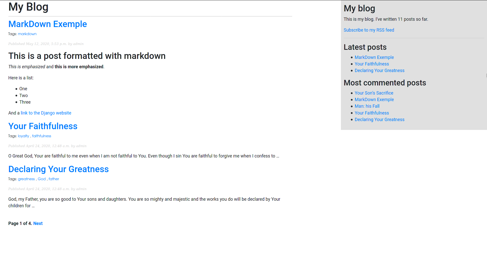

# BlogApp
> This is a blog django project commented line by line of code.

[![NPM Version][npm-image]][npm-url]
[![Build Status][travis-image]][travis-url]
[![Downloads Stats][npm-downloads]][npm-url]

BlogApp is a real world and self explanatory Blog Application made in Django and commented 
line by line of code. Let's learn Django development.



## Installation

Linux:

```sh
npm install my-crazy-module --save
```

Windows:

```sh
I strongly recommend you go by Linux.
```
Install PostgreSQL:
```sh
sudo dnf install postgresql postgresql-contrib postgresql-server
```
Config PostgreSQL:
```sh
sudo nano /var/lib/pgsql/data/pg_hba.conf
```
Change ident to md5 as below:
```sh
# IPv4 local connections:
#host    all             all             127.0.0.1/32            ident
host    all             all             127.0.0.1/32            md5
# IPv6 local connections:
#host    all             all             ::1/128                 ident
host    all             all             ::1/128                 md5
```
Reboot the service:
```sh
sudo service postgresql stop
sudo service postgresql start
```
Create an user and a database:
```sh
sudo su - postgres
psql
CREATE USER blogapp WITH PASSWORD 'yourpassword';
CREATE DATABASE blogapp WITH OWNER blogapp;
GRANT ALL PRIVILEGES ON DATABASE blogapp TO blogapp;
```
Migrating from SQLite to PostgreSQL (do this migration only at the end of the project)

Make sure you install PostgreSQL drivers for python:
```sh
$ pip install psycopg2-binary
```
BackUp you SQLite db to db.json:
```sh
$ python manage.py dumpdata > db.json
```
Edit your settings.py:
```sh
DATABASES = {
    'default': {
        'ENGINE': 'django.db.backends.postgresql_psycopg2',
        'NAME': 'myproject',
        'USER': 'myprojectuser',
        'PASSWORD': 'password',
        'HOST': 'localhost',
        'PORT': '',
    }
}
```
Recreate database structures:
```sh
$ python manage.py migrate
```
At this point you can check new database tables with any PostgreSQL client and
see if the tables are already there.

Let's move on, Fire up python shell.
```sh
$ python manage.py shell

>>>from django.contrib.contenttypes.models import ContentType
>>>ContentType.objects.all().delete()
>>>exit()
```
Finally, load data from your backup.
```sh
$ python manage.py loaddata db.json
```
## Usage example

I'm still editing it...

A few motivating and useful examples of how your product can be used. Spice this up with code blocks and potentially more screenshots.

_For more examples and usage, please refer to the [Wiki][wiki]._

## Development setup

Describe how to install all development dependencies and how to run an automated test-suite of some kind. Potentially do this for multiple platforms.

```sh
make install
npm test
```

## Release History

* 0.2.1
    * CHANGE: Update docs (module code remains unchanged)
* 0.2.0
    * CHANGE: Remove `setDefaultXYZ()`
    * ADD: Add `init()`
* 0.1.1
    * FIX: Crash when calling `baz()` (Thanks @GenerousContributorName!)
* 0.1.0
    * The first proper release
    * CHANGE: Rename `foo()` to `bar()`
* 0.0.1
    * Work in progress

## Meta

Your Name – [@YourTwitter](https://twitter.com/dbader_org) – YourEmail@example.com

Distributed under the XYZ license. See ``LICENSE`` for more information.

[https://github.com/yourname/github-link](https://github.com/dbader/)

## Contributing

1. Fork it (<https://github.com/yourname/yourproject/fork>)
2. Create your feature branch (`git checkout -b feature/fooBar`)
3. Commit your changes (`git commit -am 'Add some fooBar'`)
4. Push to the branch (`git push origin feature/fooBar`)
5. Create a new Pull Request

<!-- Markdown link & img dfn's -->
[npm-image]: https://img.shields.io/npm/v/datadog-metrics.svg?style=flat-square
[npm-url]: https://npmjs.org/package/datadog-metrics
[npm-downloads]: https://img.shields.io/npm/dm/datadog-metrics.svg?style=flat-square
[travis-image]: https://img.shields.io/travis/dbader/node-datadog-metrics/master.svg?style=flat-square
[travis-url]: https://travis-ci.org/dbader/node-datadog-metrics
[wiki]: https://github.com/yourname/yourproject/wiki
